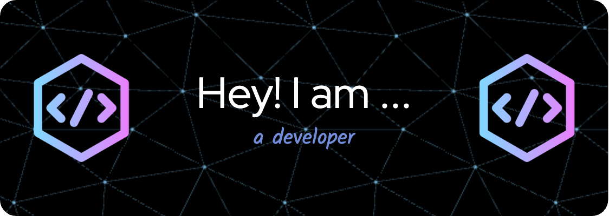

<h1 align="center">Hi 👋, I'm Nik</h1>
<h3 align="center">A passionate and curious learner diving deep into **cybersecurity**</h3>

---

## 🚀 About Me:

   

### 📖 Currently Learning

- 🌐 **Platforms**
  - **TryHackMe** – Hands-on cybersecurity labs  
  - **HTB Academy** – Interactive cybersecurity training  
  - **Coursera** – Online courses and professional certificates  
  - **NetAcad** – Cisco Networking Academy for networking and cybersecurity  
  - **Professor Messer** – Free certification prep for CompTIA exams  
  - **Codédex** – Learn-to-code RPG adventure  
  - **DataCamp** – Learn data science and Python through interactive coding  
  - **TCM Security Academy** – Practical cybersecurity and ethical hacking training  
  - **Udemy** – Affordable courses on programming, cybersecurity, and certifications

### 💻 Courses & Certifications

- **Studying for the CompTIA Security+ Exam**  
  - **Materials:**  
    - **CompTIA Security+ Study Guide with Practice Tests** *(SYBEX, a Wiley brand)*  
    - **CompTIA Bible 3-in-1 Study Guide: Security+, Network+, A+** *(Bytecert Publishing)*

- **Enrolled in the Cisco NetAcad Junior Cybersecurity Path**  
  - Preparing for the **CCST Cybersecurity** certification

- **Currently Taking the Codédex React Course** *(Intermediate Level)*

---

### ⏳ Ongoing Process

   - ✅ - Working on the **Google IT Support Professional Certificate** (Coursera) 
   
---

### 🎓 Recently Completed

   - ✅ **Google Cybersecurity Specialization** (Coursera)
   - ✅ **Mastercard Cybersecurity virtual experience program** (Forage)
   - ✅ **The Origins Trilogy: HTML, CSS, Javascript** (Codédex)
   - ✅ **The Legends of Python: Python, Intermediate Python, Numpy** (Codédex)
   - ✅ **Python Programming Fundamentals Skill Track** (DataCamp)

---

### 🎯 Current Goals

   - Strengthen my knowledge in **SQL** and **Python**
   - Practice and solidify my **JavaScript** fundamentals
   - Review and improve my **React** basics for web development
   - Pass the **CompTIA Security+** certification  
   - Apply for an **entry-level cybersecurity job** or **entry-level sofware development job** to start my career 

---

### 💼 Projects & Profiles

   - 🌐 **Portfolio Website**: [nikpiao-dev.github.io/web-portfolio](https://nikpiao-dev.github.io/web-portfolio)
   - 🧠 **Codedex Profile**: [codedex.io/@np430](https://codedex.io/@np430)
   - 🤝 **WCoding Final Group Project**: [github.com/habibullo-dev/fullstack-project](https://github.com/habibullo-dev/fullstack-project)
   - 📸 **Instagram**: [instagram.com/nikp22](https://www.instagram.com/nikp22/)
   - 💬 **Discord**: Add or DM me (dabbing_panda30)

---

### 📫 Contact Me

   - ✉️ Email: **nik.piao26@gmail.com**

---

### ⚡ Fun Fact

   - I enjoy playing **Dota 2** and **Pokémon** in my free time!

---

### 📊 GitHub Stats: 

  

  

### 📬 Connect with Me:

  
  
  

### 🛠️ Languages and Tools:

  
  
  
  
  
  
  
  

### 🖥️ Operating Systems:

  
  
  

